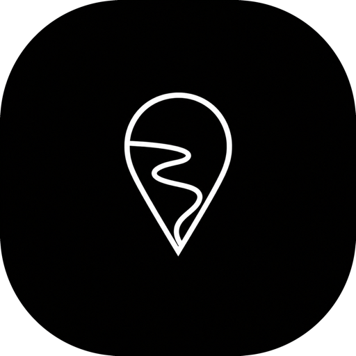

<p align="center">
  
</p>

<h1 align="center">RedRiveRR GPS Spoofer</h1>

<p align="center">
  <a href="https://github.com/RedRiveRR/RedRiveRR-GPS-Spoofer/releases/tag/v1.1.0-rc.7"></a>
  
  
  
  
</p>

> RedRiveRR GPS Spoofer tescilli, kapalı kaynak bir yazılımdır. Bu repo resmi binary dağıtım sayfasıdır; kaynak kod sunmaz ve lisansta açıkça izin verilen durumlar dışında yazılımı kopyalama, değiştirme, tersine mühendislik veya yeniden dağıtma izni vermez.

[English](README.en.md) · [Sürüm notları](CHANGELOG.md) · [Güvenlik](SECURITY.md) · [Lisans](LICENSE)

## Güncel Sürüm

`1.1.0-rc.7`, Intel ve Apple Silicon Mac'ler için bir ön sürüm release candidate paketidir. Kararlı sürüm değildir.

- [Universal DMG dosyasını indir](https://github.com/RedRiveRR/RedRiveRR-GPS-Spoofer/releases/download/v1.1.0-rc.7/RedRiveRR-GPS-Spoofer-1.1.0-rc.7-universal.dmg)
- [SHA-256 doğrulama dosyasını indir](https://github.com/RedRiveRR/RedRiveRR-GPS-Spoofer/releases/download/v1.1.0-rc.7/RedRiveRR-GPS-Spoofer-1.1.0-rc.7-universal.dmg.sha256)

Yayımlanan SHA-256:

```text
dc94623ab115ee52cb19cab9fffa828a08cebea724b3707a10cbc85138868475
```

## Gereksinimler

| Bileşen | Gereksinim |
| --- | --- |
| macOS | 12.7 veya sonrası |
| Mac | Intel veya Apple Silicon |
| iPhone | Developer Mode açık olmalı |
| Bağlantı | Kilidi açık, güvenilmiş USB bağlantısı önerilir |
| iOS | iOS 17.4 ve sonrası userspace desteği; iOS 17.0-17.3.x desteklenmez |
| Runtime | Sağlıklı app-managed runtime yoksa uyumlu Python 3 gerekir |

Jailbreak, root erişimi, `sudo`, yönetici AppleScript'i veya kalıcı kernel tunnel gerekmez.

## Kurulum

1. DMG ve doğrulama dosyasını Release sayfasından indirin.
2. Terminal'de checksum değerini doğrulayın:

   ```bash
   shasum -a 256 RedRiveRR-GPS-Spoofer-1.1.0-rc.7-universal.dmg
   ```

3. DMG dosyasını açın ve **RedRiveRR GPS Spoofer** uygulamasını **Applications** klasörüne sürükleyin.
4. Uygulamayı açın, iPhone'u bağlayıp güvenin ve hedef cihazı uygulamada açıkça seçin.

RC7 imzasızdır ve Apple notarization işlemi yapılmamıştır. Son Apple dağıtım kimlik bilgileri ve daha geniş fiziksel UI doğrulaması tamamlanırken değerlendirme amacıyla sunulur.

## macOS Gatekeeper Uyarısı

RC7, Apple tarafından verilmiş bir Developer ID sertifikasıyla imzalanmamıştır ve Apple notarization işleminden geçmemiştir. Bu nedenle güncel DMG açılırken macOS geliştiricinin doğrulanamadığını veya uygulamanın kötü amaçlı yazılım içerip içermediğinin denetlenemediğini söyleyen uyarıyı gösterir. Bu uyarı, Gatekeeper'ın uygulama için kullanılabilir bir imza veya notarization bileti bulamadığı anlamına gelir; macOS'un uygulamayı kötü amaçlı yazılıma karşı denetleyip onayladığı anlamına gelmez.

Yalnızca DMG dosyasını resmi RedRiveRR GitHub Release sayfasından indirdiyseniz ve SHA-256 değeri yukarıda yayımlanan değerle eşleşiyorsa devam edin.

Güncel RC sürümünü Apple'ın desteklediği güvenlik istisnası akışıyla açmak için:

1. Uyarı penceresinde **Vazgeç** veya **Bitti** seçeneğini seçin. Uygulamayı Çöp Sepeti'ne taşımayın.
2. macOS Ventura 13 veya sonrasında **Sistem Ayarları → Gizlilik ve Güvenlik** bölümünü açın. macOS Monterey 12'de **Sistem Tercihleri → Güvenlik ve Gizlilik → Genel** bölümünü açın ve istenirse kilit simgesini açın.
3. RedRiveRR GPS Spoofer için **Yine de Aç** seçeneğine basın.
4. İstendiğinde Mac giriş parolanız veya Touch ID ile doğrulama yapın.
5. Uyarı yeniden gösterildiğinde **Aç** seçeneğini seçin.

Apple'a göre **Yine de Aç** seçeneği engellenen açma denemesinden sonra yaklaşık bir saat kullanılabilir. Seçenek görünmüyorsa uygulamayı bir kez daha açmayı deneyip Gizlilik ve Güvenlik sayfasına geri dönün. Şirket veya okul tarafından yönetilen Mac'lerde bu istisna engellenebilir.

Gatekeeper'ı kapatmayın ve Terminal komutlarıyla quarantine niteliğini kaldırmayın. Bu genel yöntemler macOS korumasını zayıflatır ve desteklenen kurulum sürecinin parçası değildir. Apple'ın [Mac'inizde uygulamaları güvenle açma](https://support.apple.com/en-gb/102445) yönergesine bakabilirsiniz.

Kalıcı yayıncı çözümü; Apple Developer Program erişimi edinmek, yeni sürümü Apple **Developer ID Application** sertifikası, Hardened Runtime ve güvenli timestamp ile imzalamak, Apple notary servisine göndermek ve notarization biletini DMG'ye staple etmektir. Sürüm yayımlanmadan önce `codesign`, `stapler` ve Gatekeeper kontrollerinden geçmelidir. Apple bu dağıtım modelini [Developer ID sertifikaları](https://developer.apple.com/help/account/certificates/create-developer-id-certificates) ve [notarization sorunlarını çözme](https://developer.apple.com/documentation/security/resolving-common-notarization-issues) belgelerinde açıklar. Doğru şekilde imzalanıp notarize edilmiş yeni bir paket, bu doğrulanamayan geliştirici uyarısı olmadan normal macOS onay akışıyla açılmalıdır.

## Runtime Kurulumu

RC7, uygulama içinden sessiz kurulum denemek yerine yönlendirmeli Terminal kurulumu kullanır. Python'ı kendisi kurmaz.

Uyumlu Python 3 varsa **Runtime Setup** ekranındaki komut:

- `~/Library/Application Support/RedRiveRR GPS Spoofer/Runtime/venv` içinde izole bir virtual environment oluşturur;
- bu ortama `pymobiledevice3==10.3.0`, `urllib3<2`, `cryptography<47` ve bağımlılıklarını kurar;
- macOS socket-buffer uyumluluk düzeltmesini uygular ve bundled konum oturumu helper'ını doğrulama için hazırlar;
- root, `sudo`, yönetici yetkisi, Homebrew değişikliği, global pip kurulumu veya user-site paket değişikliği kullanmaz.

### İlk Runtime Kurulumu

1. Mac'i internete bağlı tutun ve uygulamayı açın.
2. **Need help?** yanındaki **Runtime Setup** ekranını açın. Python eksik bildiriliyorsa resmi Python sitesinden Python 3 kurun, uygulamayı yeniden açın ve Runtime Setup'a dönün.
3. Uygulamanın gösterdiği komutun tamamını kopyalayın ve **Open Terminal** seçeneğine basın.
4. Komutu Terminal'e yapıştırıp Return tuşuna basın ve tamamlanma mesajını bekleyin. Paket indirme ve kurulum birkaç dakika sürebilir.
5. Uygulamaya dönüp **Check Runtime** seçeneğine basın. `pymobiledevice3 10.3.0` ve doğru host mimarisiyle sağlıklı app-managed runtime bildirilmeden devam etmeyin.
6. iPhone'u bağlayın, kilidini açıp bilgisayara güvenin, cihaz listesini yenileyin ve hedef cihazı açıkça seçin.

Global `pip install` yerine uygulamanın oluşturduğu eksiksiz komutu kullanın ve `sudo` eklemeyin. App-managed runtime; paket, mimari, userspace DVT CLI, patch metadata, socket preflight ve helper health check'leri geçmeden kabul edilmez.

### Python Bulunmayan Mac

Güncel DMG bağımsız bir Python runtime içermez. Uyumlu Python 3 bulunmayan gerçekten temiz bir Mac'te önce Python 3 kurun, Runtime Setup ekranını yeniden açın ve uygulamanın gösterdiği komutu çalıştırın. Bu durum release candidate sınırlaması olmaya devam eder; gelecekte tamamen bağımsız DMG için imzalanmış bundled Python runtime veya derlenmiş native helper gerekir.

### Temiz Yeniden Kurulum Testi

Sistem araçlarını değiştirmeden managed installer'ı yeniden test etmek için:

1. Aktif konum oturumunu durdurun ve RedRiveRR GPS Spoofer uygulamasını normal şekilde kapatın.
2. Yalnızca `~/Library/Application Support/RedRiveRR GPS Spoofer/Runtime` klasörünü Çöp Sepeti'ne taşıyın.
3. `/usr/bin/python3`, Xcode Python, Homebrew Python, RedRiveRR Application Support klasörünün tamamı, Keychain öğeleri, geçmiş veya favorileri silmeyin.
4. Uygulamayı yeniden açın ve yukarıdaki **İlk Runtime Kurulumu** adımlarını izleyin. Gösterilen Terminal komutunu çalıştırmadan bağımlılıklar yeniden kurulmaz.

Runtime klasörünü kaldırmak uygulamanın yönettiği Python paketlerini siler. Uygulamayı kaldırmaz; kayıtlı geçmişi ve favorileri silmez.

## Ücretsiz Haklar Ve Lisans Anahtarı

- Yeni bir yerel uygulama profili `5/5` ücretsiz başarılı tek nokta konum değişikliğiyle başlar.
- Her başarılı **Apply Location**, favori veya geçmiş koordinatı güncellemesi bir hak kullanır. Başarısız Apply hak kullanmaz.
- Kalan hak sayısı yerel olarak saklanır; uygulama kapatıldığında veya Mac yeniden başlatıldığında korunur.
- `0/5` sonrasında yeni konum değişiklikleri, RedRiveRR tarafından ayrıca sağlanan geçerli RC7 lisans anahtarı etkinleştirilene kadar kilitlenir.
- Route ve joystick işlevleri ücretsiz hak sayacıyla açılmaz.
- Clear, Stop ve güvenlik temizliği sayaç veya lisans durumundan dolayı asla engellenmez.

Lisans anahtarları bu repoda veya Release notlarında yayımlanmaz. Anahtarı GitHub Issues, ekran görüntüsü veya log içinde paylaşmayın.

## Kullanım Ve Güvenlik

- Apply, açıkça seçilmiş cihaz için userspace konum oturumu başlatır.
- Koordinat güncellemeleri oturum çalışırken uygulamanın yönettiği aynı oturumu kullanır.
- Stop, Clear komutunu gönderir ve uygulamanın yönettiği oturumu kapatır.
- Clear, Stop ve güvenlik temizliği lisans durumundan bağımsız olarak kullanılabilir kalır.
- Clear komutunun tamamlanması iPhone'un fiziksel GPS durumunu bağımsız olarak kanıtlamaz. Gerçek konumun döndüğünü Apple Maps veya Compass üzerinden doğrulayın.

## Ağ Ve Gizlilik

- Konum komutları seçilen cihaza yerel olarak gönderilir.
- Apple MapKit harita verisi indirebilir.
- Runtime kurulumu sabitlenmiş paketleri ve bağımlılıkları indirebilir.
- Güncelleme kontrolü public GitHub sürüm bilgisini sorgulayabilir.
- Bu release candidate içinde production ödeme ve online lisanslama aktif değildir. RC7, beş ücretsiz hak bittikten sonra ayrıca sağlanan test lisans anahtarını yerel olarak doğrulayabilir.

## Destek

Tekrarlanabilir ürün sorunları için [GitHub Issues](https://github.com/RedRiveRR/RedRiveRR-GPS-Spoofer/issues) sayfasını kullanın. Lisans anahtarı, cihaz kimliği, kişisel konum verisi, secret içeren log veya başka özel bilgiler paylaşmayın. Güvenlik sorunlarını [SECURITY.md](SECURITY.md) içindeki özel bildirim yöntemiyle iletin.

## Lisans

Copyright © 2024-2026 RedRiveRR. Tüm hakları saklıdır. Bu yazılım tescilli ve kapalı kaynaktır. Ayrıntılar için [LICENSE](LICENSE) dosyasına bakın.
